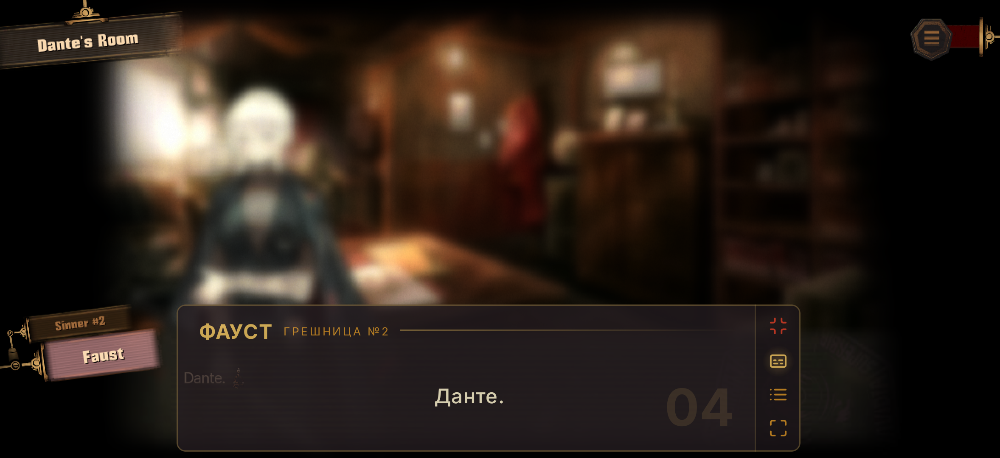
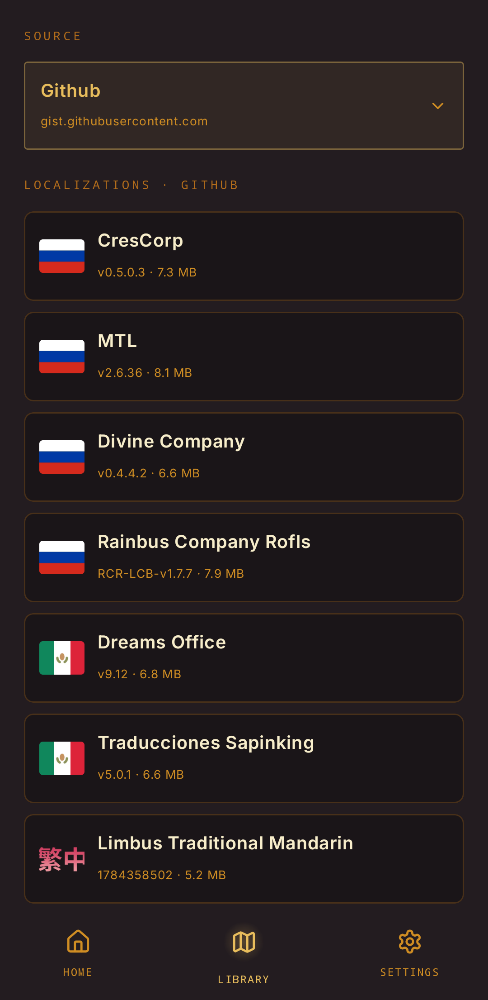
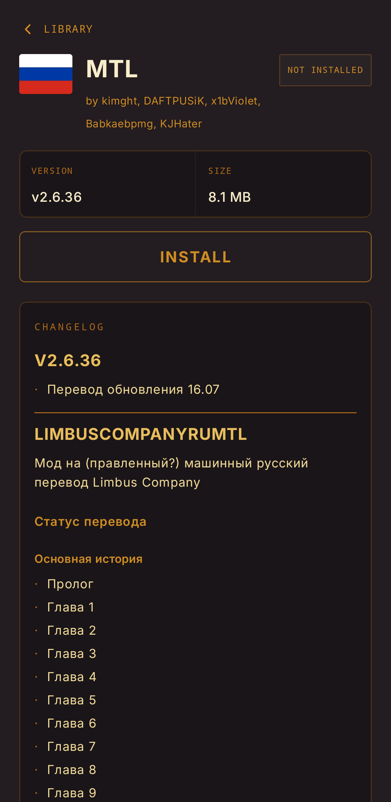
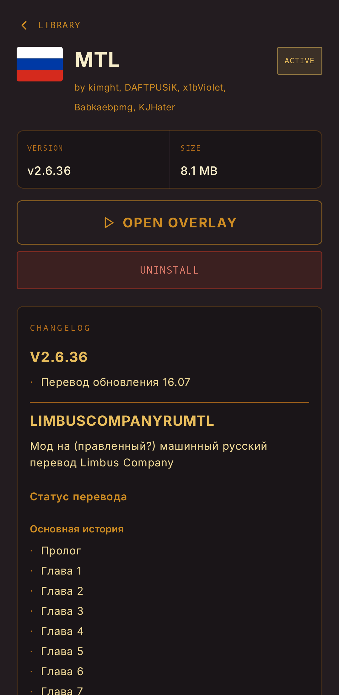
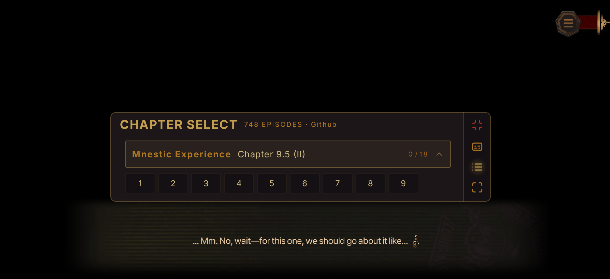
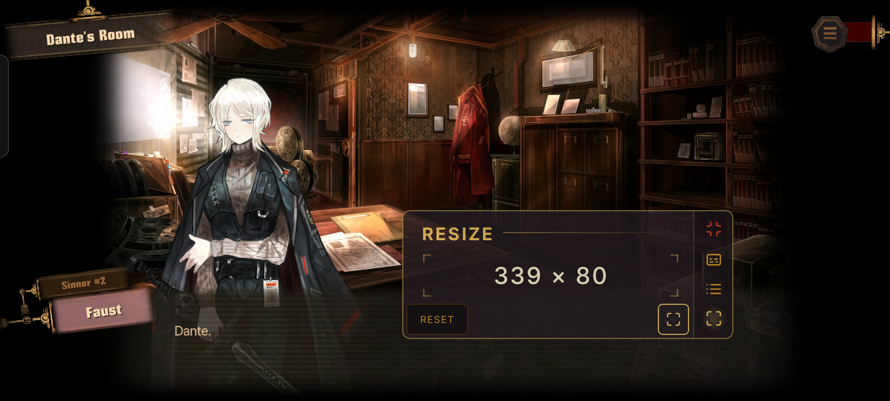

  

[English](/ru.md) · **Русский**

# Limbus Screen Translator

**Фанатские переводы — прямо поверх _Limbus Company_.**

Плавающее окно для чтения перевода истории не выходя из игры.

**[Скачать последнюю версию APK](https://github.com/kimght/LimbusScreenTranslator/releases/latest)** · [Установка](#установка) · [Использование](#использование)

  

## Кратко

- **Локализации от сообщества** — просматривайте переводы и устанавливайте нужный.
- **Общий каталог локализаций** — используйте те же переводы, что доступны в [Limbus Localization Manager](https://github.com/kimght/LimbusLocalizationManager).
- **Отдельно от игры** — переводы отображаются поверх *Limbus Company*; приложение не изменяет её файлы.

## Установка

Limbus Screen Translator требует **Android 9 или новее**.

1. Скачайте APK из [последнего релиза](https://github.com/kimght/LimbusScreenTranslator/releases/latest).
2. Откройте загруженный файл и, если андроид попросит, разрешите установку из этого источника.
3. Установите и откройте **Limbus Screen Translator**.

> [!WARNING]
> **Google Play Protect может предупредить об APK, установленном не из Google Play.** Продолжайте, только если вы скачали файл из этого репозитория и доверяете ему. Разверните **Подробнее**, затем выберите **Всё равно установить**. Формулировки могут отличаться на разных устройствах.

> [!IMPORTANT]
> Андроид может применить к приложениям, установленным из APK, **ограниченные настройки**, из-за чего не удастся включить **Показывать поверх других приложений**. Если разрешение недоступно, откройте **Настройки → Приложения → Limbus Screen Translator → Ещё → Разрешить ограниченные настройки**, затем повторите попытку. Подробнее — в [руководстве Google по ограниченным настройкам](https://support.google.com/android/answer/12623953).

## Использование

### 1. Выберите локализацию

Откройте **Библиотеку**, выберите источник, затем нужный пакет локализации.

> [!TIP]
> Некоторые источники могут быть недоступны в отдельных странах. Если не удаётся подключиться к источнику, выберите другой в переключателе источников в **Библиотеке**. Добавлять и удалять источники можно в разделе **Настройки → Источники локализаций**. Все источники содержат одинаковые пакеты локализаций.

### 2. Установите пакет

Нажмите **Установить** на странице сведений о переводе. Когда загрузка завершится, нажмите **Сделать активным**.

### 3. Запустите плавающее окно

Нажмите **Открыть переводчик**, при запросе предоставьте разрешение на уведомления и включите **Показывать поверх других приложений**. Когда появятся элементы управления плавающим окном, запустите *Limbus Company*.

<table>
  <tr>
    <td align="center" width="33%">
      <strong>01 · Выберите</strong>  
      
    </td>
    <td align="center" width="33%">
      <strong>02 · Установите</strong>  
      
    </td>
    <td align="center" width="33%">
      <strong>03 · Играйте</strong>  
      
    </td>
  </tr>
</table>

### Управление переводчиком

- Перетащите заголовок плавающего окна туда, где вам будет удобно; при необходимости измените размер окна.
- Откройте выбор главы и выберите эпизод, соответствующий текущей сцене; используйте быструю навигацию, чтобы перейти к следующему или предыдущему эпизоду.
- Листайте, чтобы перейти к следующей или предыдущей строке диалога, либо перейдите к следующей строке быстрым нажатием.
- Сворачивайте плавающее окно во время игры.

<table>
  <tr>
    <td align="center" width="50%">
       
      <strong>Выберите нужные главу и эпизод</strong>
    </td>
    <td align="center" width="50%">
       
      <strong>Перемещайте, изменяйте размер или сворачивайте плавающее окно</strong>
    </td>
  </tr>
</table>

## Участники

## Лицензия

Распространяется на условиях, указанных в [LICENSE](../../LICENSE).
